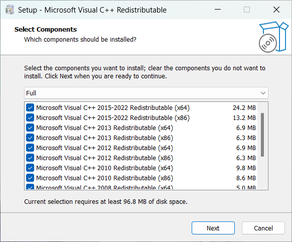

# VCRedistSetup

🌍 **[简体中文](README-CN.md) | [English](README.md)**

An integrated package of Microsoft Visual C++ Redistributable allows you to easily install any version between 80 and 140.  

## Preview

## License

This project is licensed under the MIT License - see the [LICENSE](LICENSE.md) file for details.

## Official link

- [Microsoft Visual C++ Redistributable latest supported downloads](https://learn.microsoft.com/en-US/cpp/windows/latest-supported-vc-redist)
- [Visual C++ What's New 2003 through 2015](https://learn.microsoft.com/zh-cn/cpp/porting/visual-cpp-what-s-new-2003-through-2015)
